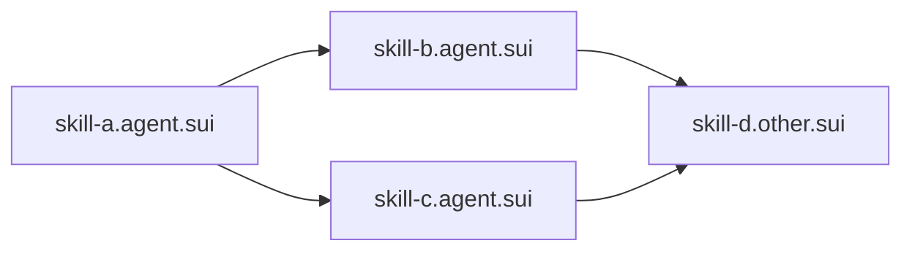

# Design Document: Walrus Skill Lifecycle (Upload + Execute Pipeline)

## Overview

This feature replaces the local-only skill registry with a decentralized pipeline where skill manifests are stored on Walrus (via Harbor API), referenced on-chain via `SkillDescriptor` objects, and discoverable through SuiNS subnames. The core UX is: **import a SuiNS skill name and the agent can use that skill** — like importing a package by name.

The system provides two pipelines:

1. **Upload Pipeline**: Serialize manifest → upload to Walrus → create/update SkillDescriptor on-chain → bind SuiNS subname
2. **Execution Pipeline**: Resolve SuiNS name → fetch SkillDescriptor → download manifest from Walrus → verify integrity → resolve dependencies → build PTB → execute

Private skills are gated by Seal encryption with sui-groups membership checks, requiring decryption credentials before manifest access.

### Key Design Decisions

1. **Harbor API as Walrus gateway** — Uses `https://api.testnet.harbor.walrus.xyz` REST API for blob upload/download. Authenticated via `hbr_` prefixed API keys. Avoids direct Walrus node interaction for simplicity.
2. **SHA-256 integrity verification** — Every manifest gets a hash computed before upload and verified after download. The hash is stored on-chain in the SkillDescriptor for trustless verification.
3. **SuiNS subnames as skill addresses** — `{skillName}.{agentName}.sui` resolves directly to the SkillDescriptor object. This enables the "import by name" UX.
4. **Topological dependency resolution** — Dependencies are declared as SuiNS subnames and resolved recursively in topological order with cycle detection before execution.
5. **Update-in-place for upgrades** — The SkillDescriptor gets an `update` entry function that overwrites blob/hash/version while preserving the object ID and SuiNS binding.
6. **Seal encryption for private skills** — Optional per-skill. Encrypted manifests are uploaded to Walrus as ciphertext; decryption requires sui-groups membership proof.
7. **PTB construction from manifest** — The `sui.movePackage` + `sui.entry` fields in the manifest are sufficient to construct a Programmable Transaction Block without additional configuration.

## Architecture

```mermaid
graph TD
    subgraph Walrus [Walrus Network]
        HB[Harbor API] -->|store| BLOB[Walrus Blob]
    end

    subgraph OnChain [Sui Blockchain]
        SD[SkillDescriptor] -->|walrus_manifest_blob| BLOB
        SD -->|manifest_hash| HASH[SHA-256]
        SD -->|dependencies| DEPS[SuiNS Subnames]
        SUINS[SuiNS Subname] -->|resolves to| SD
    end

    subgraph SDK [@agentos/sdk]
        CLIENT[AgentOSClient] -->|uploadManifest| HB
        CLIENT -->|downloadManifest| HB
        CLIENT -->|publishSkill| OnChain
        CLIENT -->|resolveSkill| SUINS
        CLIENT -->|executeSkill| PTB[PTB Builder]
        PTB -->|execute| OnChain
        DEP[DependencyResolver] -->|topological sort| CLIENT
    end

    subgraph CLI [@agentos/cli]
        PUB[skill publish] --> CLIENT
        EXEC[skill execute] --> CLIENT
        RES[skill resolve] --> CLIENT
    end

    subgraph MCP [@agentos/mcp]
        MPUB[agentos_publish_skill] --> CLIENT
        MEXEC[agentos_execute_skill] --> CLIENT
        MRES[agentos_resolve_manifest] --> CLIENT
    end

    subgraph Frontend [Next.js]
        UI[/agent/name/skills] -->|dapp-kit| CLIENT
        UI -->|dependency graph| VIS[Visualization]
    end
```

### Flow: Upload Pipeline (Publish)

1. Developer invokes `publishSkill` (via SDK, CLI, or MCP)
2. SDK validates `manifestType === 'sui-agent-skill/v1'`
3. SDK serializes manifest to JSON, computes SHA-256 hash
4. (Optional) If `sealPolicyId` provided, encrypt JSON with Seal before upload
5. SDK POSTs to Harbor API: `POST /api/v1/spaces/{spaceId}/buckets/{bucketId}/files`
6. Harbor returns `blobId`
7. SDK builds PTB:
   - If new skill: calls `skill_descriptor::create` + SuiNS subname creation
   - If existing skill: calls `skill_descriptor::update`
8. SDK executes PTB, updates local registry with blobId, hash, object ID, subname

### Flow: Execution Pipeline (Resolve + Execute)

1. Agent receives skill SuiNS name (e.g., `trade.alpha-agent.sui`)
2. SDK resolves SuiNS name → SkillDescriptor object address
3. SDK fetches SkillDescriptor fields from on-chain
4. SDK downloads manifest blob from Walrus using `walrus_manifest_blob`
5. (Optional) If `seal_policy_id` non-empty, decrypt with Seal
6. SDK verifies SHA-256 hash matches `manifest_hash`
7. SDK recursively resolves dependencies (topological order, cycle detection)
8. SDK verifies agent has required capabilities from `sui.policyRequired`
9. SDK constructs PTB from `sui.movePackage` + `sui.entry` + parameters
10. SDK executes PTB, returns transaction digest and effects

### Flow: Dependency Resolution



Resolution proceeds bottom-up: D → B → C → A (topological order). If a cycle is detected (e.g., A → B → A), resolution aborts with the cycle path.

## Components and Interfaces

### 1. Move Module: `skill_descriptor.move` (Updated)

Add `update` entry function and `seal_policy_id` field:

```move
module agentos::skill_descriptor {
    const E_NOT_OWNER: u64 = 1;

    public struct SkillDescriptor has key, store {
        id: UID,
        skill_id: vector<u8>,
        walrus_manifest_blob: vector<u8>,
        manifest_hash: vector<u8>,
        mvr_package_name: vector<u8>,
        version: vector<u8>,
        required_capabilities: vector<vector<u8>>,
        dependencies: vector<vector<u8>>,
        seal_policy_id: vector<u8>,  // empty for public, policy address for private
    }

    public fun create(
        _skill_id: vector<u8>,
        _walrus_manifest_blob: vector<u8>,
        _manifest_hash: vector<u8>,
        _mvr_package_name: vector<u8>,
        _version: vector<u8>,
        ctx: &mut TxContext,
    ): SkillDescriptor;

    /// Update an existing descriptor. Only object owner can call.
    public entry fun update(
        descriptor: &mut SkillDescriptor,
        new_walrus_manifest_blob: vector<u8>,
        new_manifest_hash: vector<u8>,
        new_version: vector<u8>,
        ctx: &TxContext,
    );
}
```

### 2. SDK: Harbor Client (`packages/sdk/src/harbor.ts`)

```typescript
export interface HarborUploadResult {
  blobId: string;
  manifestHash: string;
}

export interface HarborClientOptions {
  apiKey: string;
  baseUrl?: string; // defaults to https://api.testnet.harbor.walrus.xyz
}

export class HarborClient {
  constructor(options: HarborClientOptions);

  async uploadBlob(
    spaceId: string,
    bucketId: string,
    content: Uint8Array,
    filename: string,
  ): Promise<{ blobId: string }>;

  async downloadBlob(blobId: string): Promise<Uint8Array>;
}
```

### 3. SDK: Manifest Utilities (`packages/sdk/src/manifest.ts`)

```typescript
export function serializeManifest(manifest: SkillManifest): Uint8Array;
export function deserializeManifest(data: Uint8Array): SkillManifest;
export function computeManifestHash(data: Uint8Array): string; // hex-encoded SHA-256
export function validateManifest(manifest: SkillManifest): void; // throws on invalid
```

### 4. SDK: Dependency Resolver (`packages/sdk/src/dependency-resolver.ts`)

```typescript
export interface ResolvedDependency {
  name: string; // SuiNS subname
  descriptor: SkillDescriptor;
  manifest: SkillManifest;
}

export class DependencyResolver {
  constructor(client: AgentOSClient);

  /** Resolve all dependencies in topological order. Throws on cycles. */
  async resolve(manifest: SkillManifest): Promise<ResolvedDependency[]>;

  /** Detect cycles in a dependency graph. Returns cycle path or null. */
  detectCycle(adjacencyList: Map<string, string[]>): string[] | null;

  /** Topological sort of a DAG. Returns ordered node list. */
  topologicalSort(adjacencyList: Map<string, string[]>): string[];
}
```

### 5. SDK: AgentOSClient Extensions

Updated methods on `AgentOSClient`:

```typescript
// Upload manifest to Walrus, return blobId + hash
async uploadManifest(
  bucketId: string,
  manifest: SkillManifest,
  options?: { sealPolicyId?: string },
): Promise<HarborUploadResult>;

// Download manifest from Walrus, verify hash
async downloadManifest(
  blobId: string,
  expectedHash: string,
  options?: { sealPolicyId?: string },
): Promise<SkillManifest>;

// Resolve SuiNS skill subname → SkillDescriptor
async resolveSkill(suinsName: string): Promise<SkillDescriptor>;

// Full publish pipeline: upload + on-chain create/update + SuiNS subname
async publishSkill(options: {
  signer: Signer;
  manifest: SkillManifest;
  bucketId: string;
  agentName: string;
  private?: { sealPolicyId: string };
}): Promise<SkillDescriptor>;

// Full execution pipeline: resolve + download + deps + PTB + execute
async executeSkill(options: {
  signer: Signer;
  suinsName: string;
  params?: Record<string, unknown>;
}): Promise<{ digest: string; effects: unknown }>;
```

### 6. SDK: Contract Bindings Update (`packages/sdk/src/contracts/skill_descriptor.ts`)

```typescript
export function update(options: {
  descriptor: TransactionObjectArgument;
  walrusManifestBlob: string;
  manifestHash: string;
  version: string;
  packageId?: string;
}): (tx: Transaction) => void;
```

### 7. CLI Commands (`packages/cli/src/commands/skill.ts`)

| Command                                       | Description                               |
| --------------------------------------------- | ----------------------------------------- |
| `skill publish <file> --agent <name>`         | Upload to Walrus + create/update on-chain |
| `skill execute <suinsName> [--params <json>]` | Resolve + download + build PTB + execute  |
| `skill resolve <suinsName> [--manifest]`      | Resolve and display metadata              |

All commands support `--dry-run`, `--json`, and `skill publish` supports `--private`.

### 8. MCP Tools (`packages/mcp/src/server.ts`)

| Tool                       | Input                                    | Output                          |
| -------------------------- | ---------------------------------------- | ------------------------------- |
| `agentos_publish_skill`    | `{agentName, manifestJson, walrusBlob?}` | `{blobId, objectId, suinsName}` |
| `agentos_execute_skill`    | `{suinsName, params?}`                   | `{digest, effects}`             |
| `agentos_resolve_manifest` | `{suinsName}`                            | `{manifest, descriptor}`        |

### 9. Frontend Page (`packages/frontend/app/agent/[name]/skills/page.tsx`)

- Display skills with Walrus explorer links (`https://walrus.xyz/blob/{blobId}`)
- Display Sui explorer links for SkillDescriptor object IDs
- Render dependency graph using a DAG visualization component
- "Private" badge for skills with `seal_policy_id`
- "Publish Upgrade" button triggering dapp-kit transaction flow
- Warning indicator if blob is unreachable

## Data Models

### On-Chain: SkillDescriptor (Updated)

| Field                   | Type                 | Description                                       |
| ----------------------- | -------------------- | ------------------------------------------------- |
| `id`                    | `UID`                | Unique object ID                                  |
| `skill_id`              | `vector<u8>`         | Skill name                                        |
| `walrus_manifest_blob`  | `vector<u8>`         | Walrus blobId                                     |
| `manifest_hash`         | `vector<u8>`         | SHA-256 of manifest JSON                          |
| `mvr_package_name`      | `vector<u8>`         | MVR human-readable package name                   |
| `version`               | `vector<u8>`         | Semver version string                             |
| `required_capabilities` | `vector<vector<u8>>` | Policy capabilities needed                        |
| `dependencies`          | `vector<vector<u8>>` | SuiNS subnames of dependencies                    |
| `seal_policy_id`        | `vector<u8>`         | Empty for public, Seal policy address for private |

### Local Registry: Skill Record (Updated)

| Field                | Type                     | Description                                  |
| -------------------- | ------------------------ | -------------------------------------------- |
| `agentSlug`          | `string`                 | Parent agent slug                            |
| `skillId`            | `string`                 | Skill identifier                             |
| `name`               | `string`                 | Human-readable name                          |
| `mvrPackage`         | `string`                 | MVR package name                             |
| `version`            | `string`                 | Semver version                               |
| `walrusManifestBlob` | `string`                 | Walrus blobId                                |
| `manifestHash`       | `string`                 | SHA-256 hex string                           |
| `objectId`           | `string`                 | On-chain SkillDescriptor ID                  |
| `suinsName`          | `string`                 | Full SuiNS subname (e.g., `trade.alpha.sui`) |
| `sealPolicyId`       | `string?`                | Seal policy for private skills               |
| `network`            | `'mainnet' \| 'testnet'` | Network                                      |
| `status`             | `'active' \| 'archived'` | Lifecycle status                             |

### SDK Types (Updated `packages/sdk/src/types.ts`)

```typescript
export interface SkillDescriptor {
  skillId: string;
  walrusManifestBlob: string;
  manifestHash: string;
  mvrPackageName: string;
  version: string;
  requiredCapabilities: string[];
  dependencies: string[];
  sealPolicyId?: string; // new field
}

export interface SkillManifest {
  name: string;
  version: string;
  publisher: string;
  manifestType: "sui-agent-skill/v1";
  mcp: {
    compatible: boolean;
    tools: SkillManifestTool[];
  };
  sui: {
    movePackage: string;
    entry: string;
    policyRequired: string[];
  };
  dependencies: string[]; // SuiNS subnames
}
```

### Harbor API Request/Response

**Upload Request:**

```
POST /api/v1/spaces/{spaceId}/buckets/{bucketId}/files
Authorization: Bearer hbr_...
Content-Type: application/octet-stream

<manifest bytes>
```

**Upload Response (2xx):**

```json
{ "blobId": "abc123...", "size": 1024 }
```

**Download Request:**

```
GET /api/v1/blobs/{blobId}
Authorization: Bearer hbr_...
```

## Correctness Properties

_A property is a characteristic or behavior that should hold true across all valid executions of a system — essentially, a formal statement about what the system should do. Properties serve as the bridge between human-readable specifications and machine-verifiable correctness guarantees._

### Property 1: Manifest serialization round-trip

_For any_ valid SkillManifest object, serializing to JSON bytes then deserializing back SHALL produce an object deeply equal to the original, and the SHA-256 hash of the serialized bytes SHALL be identical across repeated serializations of the same manifest.

**Validates: Requirements 1.2, 6.5**

### Property 2: ManifestType validation

_For any_ object with a `manifestType` field, the upload/publish pipeline SHALL accept it if and only if `manifestType === 'sui-agent-skill/v1'`. All other values SHALL be rejected with the appropriate error message.

**Validates: Requirements 1.5, 1.6**

### Property 3: Dependency encoding round-trip

_For any_ array of SuiNS subname strings (valid UTF-8), encoding to `vector<vector<u8>>` (via TextEncoder) and decoding back SHALL produce the original array.

**Validates: Requirements 2.4, 8.5**

### Property 4: Publish creates correct registry record

_For any_ valid SkillManifest and successful publish operation, the local registry SHALL contain a skill record where `skillId` equals the manifest's `name`, `version` equals the manifest's `version`, `walrusManifestBlob` equals the blobId from upload, and `manifestHash` equals the SHA-256 of the serialized manifest.

**Validates: Requirements 2.5, 4.4**

### Property 5: Update preserves identity, overwrites versioned fields

_For any_ existing SkillDescriptor with object ID X and any new manifest version, calling `update` SHALL: (a) preserve the same object ID X, (b) overwrite `walrus_manifest_blob`, `manifest_hash`, and `version` with the new values, (c) leave `skill_id` and `dependencies` unchanged unless explicitly updated.

**Validates: Requirements 3.2, 3.3**

### Property 6: Topological dependency resolution

_For any_ directed acyclic graph of skill dependencies, the resolver SHALL return all nodes in an order where every dependency appears before the skill that depends on it (valid topological sort).

**Validates: Requirements 7.2, 8.2, 8.4**

### Property 7: Cycle detection in dependency graphs

_For any_ directed graph containing at least one cycle, the dependency resolver SHALL detect the cycle and report at least one cycle path. For any directed acyclic graph, the resolver SHALL NOT report a cycle.

**Validates: Requirements 8.3**

### Property 8: Capability gate enforcement

_For any_ SkillManifest with `sui.policyRequired` array P and any agent with capabilities set C, execution SHALL proceed if and only if P ⊆ C (every required capability is present in the agent's set). Missing capabilities SHALL produce the appropriate error.

**Validates: Requirements 7.4, 7.5**

### Property 9: PTB construction from manifest fields

_For any_ valid SkillManifest, the constructed PTB SHALL contain a Move call targeting `{sui.movePackage}::{module}::{sui.entry}` with the provided parameters. The PTB target SHALL never reference a different package or entry function than what the manifest specifies.

**Validates: Requirements 7.1**

### Property 10: SuiNS skill subname qualification

_For any_ skill name S and agent name A (where A ends with `.sui`), the qualified SuiNS subname SHALL equal `{S}.{A}` (e.g., skill `trade` + agent `alpha.sui` → `trade.alpha.sui`). For agent names without `.sui` suffix, the subname SHALL be `{S}.{A}.sui`.

**Validates: Requirements 4.1, 5.1**

## Error Handling

### Move Contract Errors

| Error Code | Constant      | Trigger                                       |
| ---------- | ------------- | --------------------------------------------- |
| 1          | `E_NOT_OWNER` | Non-owner calls `update` on a SkillDescriptor |

### SDK Error Messages

| Context  | Error Message                                                                                     | Trigger                         |
| -------- | ------------------------------------------------------------------------------------------------- | ------------------------------- |
| Upload   | `"Walrus upload failed: {statusCode} {responseBody}"`                                             | Harbor API returns non-2xx      |
| Upload   | `"Harbor API key not configured. Set HARBOR_API_KEY or add harborApiKey to .agentos/config.json"` | No API key found                |
| Upload   | `"Invalid manifestType: {value}. Expected sui-agent-skill/v1"`                                    | Wrong manifestType              |
| Publish  | `"On-chain registration failed: {errorDetails}"`                                                  | Transaction execution fails     |
| Publish  | `"Skill subname already bound to different descriptor: {subname}"`                                | SuiNS conflict                  |
| Resolve  | `"Skill not found: {suinsName}"`                                                                  | SuiNS name doesn't resolve      |
| Resolve  | `"Invalid SkillDescriptor at {address}"`                                                          | Object isn't a valid descriptor |
| Download | `"Manifest integrity check failed: expected {expected}, got {actual}"`                            | Hash mismatch                   |
| Download | `"Manifest blob not found: {blobId}"`                                                             | Blob 404                        |
| Execute  | `"Failed to resolve dependency: {dependencyName}"`                                                | Dependency resolution failure   |
| Execute  | `"Missing required capability: {capability}"`                                                     | Agent lacks policy capability   |
| Execute  | `"Circular dependency detected: {cycle}"`                                                         | Cycle in dependency graph       |
| Private  | `"Access denied: not a member of group {groupId}"`                                                | Seal decryption unauthorized    |

### CLI Error Handling

- All SDK errors propagate to CLI with `process.exit(1)` and colored error output
- `--dry-run` never throws network errors (no actual execution)
- Missing `--agent` flag shows Commander.js usage error

### MCP Error Handling

- SDK errors wrapped in MCP error response objects: `{ error: "message" }`
- Invalid tool inputs rejected with validation error messages
- Never throws — always returns structured error responses

## Testing Strategy

### Property-Based Tests (PBT)

**Library**: `fast-check` via `vitest`

**Configuration**: Minimum 100 iterations per property test.

**Tag format**: `Feature: walrus-skill-lifecycle, Property {N}: {title}`

#### PBT Test Files

| File                                                    | Properties Covered                                                     |
| ------------------------------------------------------- | ---------------------------------------------------------------------- |
| `packages/sdk/src/manifest.property.test.ts`            | P1 (round-trip), P2 (validation), P3 (encoding)                        |
| `packages/sdk/src/dependency-resolver.property.test.ts` | P6 (topological), P7 (cycle detection)                                 |
| `packages/sdk/src/skill-lifecycle.property.test.ts`     | P4 (registry), P5 (update), P8 (capabilities), P9 (PTB), P10 (subname) |

### Unit Tests

| File                                                   | Coverage                                      |
| ------------------------------------------------------ | --------------------------------------------- |
| `packages/sdk/src/harbor.test.ts`                      | Harbor client upload/download, error handling |
| `packages/sdk/src/manifest.test.ts`                    | Specific manifest examples, edge cases        |
| `packages/sdk/src/dependency-resolver.test.ts`         | Specific graph examples, empty deps           |
| `packages/cli/src/commands/skill.test.ts`              | CLI command parsing, --dry-run, --json        |
| `packages/mcp/src/skill-tools.test.ts`                 | MCP tool registration, input validation       |
| `packages/contracts/tests/skill_descriptor_tests.move` | Move create/update, E_NOT_OWNER               |

### Integration Tests

| File                                                   | Coverage                                                       |
| ------------------------------------------------------ | -------------------------------------------------------------- |
| `packages/sdk/src/skill-lifecycle.integration.test.ts` | Full publish + resolve + execute flow with mocked Harbor + Sui |
| `packages/cli/src/skill.integration.test.ts`           | CLI end-to-end with mocked services                            |

### Test Coverage Goals

| Layer                   | Target                                      |
| ----------------------- | ------------------------------------------- |
| Move (skill_descriptor) | All entry/public functions, ownership check |
| SDK manifest utilities  | Serialization, hashing, validation          |
| SDK dependency resolver | DAGs, cycles, empty graphs, single-node     |
| SDK client methods      | Publish, resolve, download, execute flows   |
| CLI commands            | Publish, execute, resolve with all flags    |
| MCP tools               | All 3 tools, error cases                    |
| Frontend                | Component rendering (snapshot tests)        |
