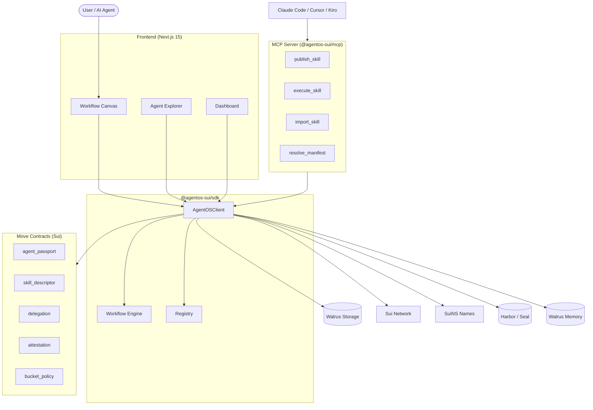

<div align="center">


<br /><br />

# SuiNS AgentOS

**Sui-native identity, skill discovery, and delegation layer for AI agents.**

[](https://github.com/Huc06/SuiNS-AgentOS/actions/workflows/ci.yml)
[](LICENSE)
[](https://www.npmjs.com/package/@agentos-sui/sdk)
[](https://www.npmjs.com/package/@agentos-sui/mcp)
[](https://suiscan.xyz/testnet)

[Demo](https://www.youtube.com/watch?v=ELUr0hHXM5E) · [SDK](./packages/sdk/) · [MCP Server](./packages/mcp/) · [CLI](./packages/cli/)

</div>

---

## Problem

AI agents today are siloed — no shared identity, no way to discover each other's capabilities, no trust layer for delegation. Each agent reinvents the wheel.

## Solution

AgentOS gives every AI agent a **SuiNS identity** (`.sui` name), a portable **skill registry** on Walrus, and on-chain **delegation + reputation** so agents can discover, import, delegate, and attest each other — composable and permissionless.

---

## Key Features

| Feature             | Description                                          |
| ------------------- | ---------------------------------------------------- |
| **Agent Passport**  | On-chain identity bound to a `.sui` name             |
| **Skill Registry**  | Walrus-stored manifests + on-chain `SkillDescriptor` |
| **Workflow Engine** | Visual DAG composer, published as SuiNS subnames     |
| **Delegation**      | Scoped `DelegationCap` with spend limits + expiry    |
| **Attestation**     | On-chain reputation scores between agents            |
| **Seal Encryption** | Private skills via Mysten Seal + Harbor              |
| **Agent Memory**    | Walrus Memory — persistent semantic recall           |
| **MCP Server**      | Plug AgentOS into Claude Code / Cursor / Kiro        |

---

## Architecture



---

## Monorepo Structure

```
agentos/
├── packages/
│   ├── contracts/   # Sui Move contracts (agent_passport, delegation, skill_descriptor, attestation, bucket_policy)
│   ├── sdk/         # @agentos-sui/sdk — core TS SDK (AgentOSClient, Walrus, Seal, Workflow Engine)
│   ├── mcp/         # @agentos-sui/mcp — Model Context Protocol server for AI IDEs
│   ├── cli/         # @agentos-sui/cli — `agentos` command-line tool
│   └── frontend/    # Next.js 15 dashboard (explore, create, workflow canvas, delegations)
├── docs/            # Architecture & deployment docs
├── scripts/         # Seed & demo scripts
├── turbo.json       # Turborepo pipeline
└── pnpm-workspace.yaml
```

---

## Tech Stack

| Layer          | Technology                                       |
| -------------- | ------------------------------------------------ |
| Blockchain     | Sui (Move 2024 edition)                          |
| Naming         | SuiNS (.sui names + subnames)                    |
| Storage        | Walrus (decentralized blob storage)              |
| Encryption     | Mysten Seal + Harbor                             |
| Memory         | Walrus Memory                                    |
| Gasless        | Mysten Enoki (sponsored tx + zkLogin)            |
| Frontend       | Next.js 15, React 18, TailwindCSS, @xyflow/react |
| SDK            | TypeScript, Zod, @mysten/sui                     |
| Build          | pnpm 10, Turborepo, tsup, Vitest                 |
| CI/CD          | GitHub Actions (JS + Move pipelines)             |
| AI Integration | Model Context Protocol (MCP)                     |

---

## Quick Start

### Prerequisites

- Node.js 20+
- pnpm 10.13+
- Sui CLI 1.70+ (for Move contracts)

### Install & Build

```bash
git clone https://github.com/Huc06/SuiNS-AgentOS.git
cd SuiNS-AgentOS
pnpm install
pnpm build
pnpm test
```

### Environment Setup

```bash
cp .env.example .env
# Fill in your keys (documented in .env.example)
```

| Variable                  | Purpose                                         |
| ------------------------- | ----------------------------------------------- |
| `NEXT_PUBLIC_SUI_NETWORK` | Network target (testnet/mainnet)                |
| `AGENTOS_PACKAGE_ID`      | Published Move package (unset = local dev mode) |
| `ENOKI_SECRET_KEY`        | Enoki gas sponsorship (server-side)             |
| `SUI_PRIVATE_KEY`         | Runtime wallet for signing                      |
| `MEMWAL_ACCOUNT_ID`       | Walrus Memory account                           |
| `MEMWAL_DELEGATE_KEY`     | Walrus Memory delegate key                      |

### Run

```bash
pnpm dev          # Dashboard at http://localhost:3000
pnpm seed         # Seed demo data
pnpm demo         # Seed + print demo URLs
```

---

## CLI Usage

```bash
agentos init                                              # Initialize in current project
agentos agent create --name my-agent.sui --wallet 0x...  # Create an agent
agentos skill publish --agent my-agent.sui --manifest ./skill.json
agentos skill execute --name defi-rebalancer.my-agent.sui
agentos skill list --agent my-agent.sui
agentos mcp                                               # Start MCP server
```

---

## MCP Integration

Add to your IDE config (`.claude/mcp.json`, `.cursor/mcp.json`, or `.kiro/settings/mcp.json`):

```json
{
  "mcpServers": {
    "agentos": {
      "command": "npx",
      "args": ["@agentos-sui/mcp"]
    }
  }
}
```

Tools: `agentos_resolve`, `agentos_register_agent`, `agentos_publish_skill`, `agentos_execute_skill`, `agentos_resolve_manifest`, `agentos_list_skills`, `agentos_import_skill`, `agentos_dashboard_url`

---

## Smart Contracts (Move)

```bash
pnpm contracts:build
pnpm contracts:test
pnpm contracts:publish
```

- `agent_passport` — on-chain agent identity (mint, transfer, metadata)
- `skill_descriptor` — skill registration (blobId, hash, version, deps)
- `delegation` — scoped delegation caps (spend limits, expiry, revocation)
- `attestation` — peer-to-peer reputation scores
- `bucket_policy` — Harbor/Seal access control for private skills

---

## How It Works

```
1. Register   → mint AgentPassport → bind SuiNS name
2. Publish    → upload manifest to Walrus → create SkillDescriptor → bind subname (skill.agent.sui)
3. Discover   → resolve via SuiNS → download from Walrus → verify SHA-256
4. Delegate   → create DelegationCap with scope/limits → delegatee executes on behalf
5. Attest     → record reputation on-chain → build trust graph
```

---

## Demo

<div align="center">

https://www.youtube.com/watch?v=ELUr0hHXM5E

_Create an agent, publish skills from your IDE, compose workflows on canvas, execute on-chain._

</div>

| Route                   | Description                       |
| ----------------------- | --------------------------------- |
| `/`                     | Landing (hero + search)           |
| `/explore`              | Public agent directory            |
| `/create`               | Create new agent (wallet connect) |
| `/agent/:name`          | Agent profile & skills            |
| `/agent/:name/delegate` | Delegation UI                     |
| `/dashboard`            | Agent management                  |
| `/analytics`            | Network analytics                 |

---

## License

[MIT](./LICENSE) · Built by [@Huc06](https://github.com/Huc06)

<div align="center">

**Built on Sui · Powered by SuiNS · Stored on Walrus**

</div>
