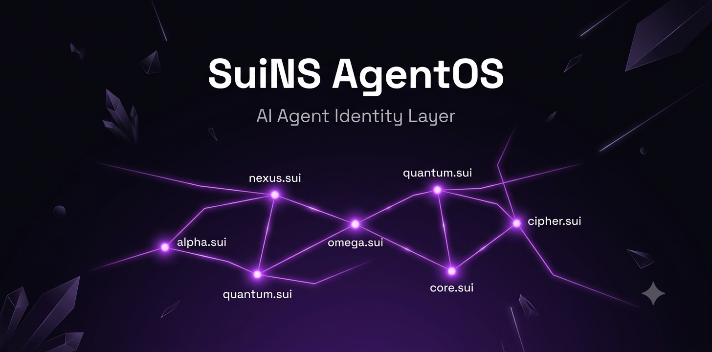

<div align="center">



<br />
<br />

**Sui-native identity, skill discovery, and delegation layer for AI agents.**

[[CI]](https://github.com/Huc06/SuiNS-AgentOS/actions/workflows/ci.yml/badge.svg)](https://github.com/Huc06/SuiNS-AgentOS/actions/workflows/ci.yml)
[[License: MIT]](https://img.shields.io/badge/license-MIT-blue.svg)
[[SDK])(https://img.shields.io/npm/v/@agentos/sdk?label=%40agentos%2Fsdk)](https://www.npmjs.com/package/@agentos/sdk)
[[MCP]](https://img.shields.io/npm/v/@agentos/mcp?label=%40agentos%2Fmcp)](https://www.npmjs.com/package/@agentos/mcp)
[[Network]](https://img.shields.io/badge/network-Sui%20Testnet-4DA2FF)](https://suiscan.xyz/testnet)

</div>
---

## Demo

<div align="center">

https://github.com/user-attachments/assets/PLACEHOLDER_DEMO_VIDEO_ID

*Create an agent → publish skills from IDE → compose workflows on canvas → run on-chain*

</div>

---

## Architecture

```
┌─────────────────────────────────────────────────────────────────┐
│ Frontend (Next.js) │
│ Landing · Agent Explorer · Workflow Canvas · Dashboard │
└──────────────────────────┬──────────────────────────────────────┘
 │ API Routes
 ┌─────────┴──────────┐
 │ SDK (@agentos/sdk) │
 └───┬───┬───┬───┘
 ┌────────┯ │ │
 ┌───┴───┐ ┌───┴─────┐ ┌───┴───┐
 │ Walrus │ │ Sui Chain │ │ SuiNS │
 │ Storage │ │ (Testnet) │ │ Names │
 └────────┘ └──────────┘ └────────┘
 │
 ┌───┴───┐ ┌─────────────┐
 │ Harbor │ │ MCP Server │ ← Claude Code / Cursor
 │ (Seal) │ │(@agentos/mcp)│
 └────────┘ └─────────────┘
```

---

## Quick Start

```bash
git clone https://github.com/Huc06/SuiNS-AgentOS.git
cd SuiNS-AgentOS
pnpm install
pnpm build
pnpm dev
```

### Environment

```bash
cp .env.example packages/frontend/.env.local
# SUI_PRIVATE_KEY, ENOKI_SECRET_KEY, NEXT_PUBLIC_AGENTOS_PACKAGE_ID
```

---

## Packages

| Package | Description | npm |
|---------|-------------|-----|
| [`packages/sdk`](./packages/sdk) | TypeScript SDK — client, registry, workflow engine, Seal, Walrus | `@agentos/sdk` |
| [`packages/mcp`](./packages/mcp) | MCP server — Claude Code, Cursor, Kiro | `@agentos/mcp` |
| [`packages/cli`](./packages/cli) | CLI — agent create, skill publish, skill execute | — |
| [`packages/contracts`](./packages/contracts) | Move 2024 — AgentPassport, SkillDescriptor, Delegation | — |
| [`packages/frontend`](./packages/frontend) | Next.js 15 — workflow builder, agent explorer | — |

---

## MCP Server

```json
{
 "mcpServers": {
 "agentos": {
 "command": "node",
 "args": ["packages/mcp/dist/index.js"],
 "cwd": "/path/to/SuiNS-AgentOS",
 "env": { "SUI_PRIVATE_KEY": "<key>", "AGENTOS_PACKAGE_ID": "0x..." }
 }
 }
}
```

| Tool | Description |
|------|-------------|
| `agentos_publish_skill` | Publish manifest → Walrus + on-chain SkillDescriptor |
| `agentos_execute_skill` | Execute skill by SuiNS name |
| `agentos_import_skill` | Import from catalog or SKILL.md |
| `agentos_resolve` | Resolve agent passport + skills |
| `agentos_list_skills` | List skills under an agent |
| `agentos_register_agent` | Register agent locally |
| `agentos_resolve_manifest` | Download + verify manifest |
| `agentos_dashboard_url` | Get dashboard URL |

---

## Workflow Engine

1. **Create Workflow** — pick agent, name it → SuiNS subname
2. **Build on Canvas** — drag skills from My Skills palette, connect nodes
3. **Run** — execute step-by-step (Enoki gas-sponsored)
4. **Publish** — upload graph manifest to Walrus

**Node types:** `Trigger` · `Walrus` · `Harbor` · `Sui` · `Memory` · `Import Agent` · `Delegate` · `Call Sub-Agent` · `Attest`

---

## On-Chain Contracts (Move 2024)

| Module | Description |
|--------|-------------|
| `agent_passport` | Mint/revoke identity, record executions |
| `skill_descriptor` | Skill on-chain records (blobId, hash, version) |
| `delegation` | Scoped DelegationCaps with spend limits |
| `attestation` | Reputation attestations (kind, score, URI) |
| `bucket_policy` | Seal access-control for private skills |

---

## Development

```bash
pnpm build # sdk → mcp → cli → frontend
pnpm test # 351 tests passing
pnpm dev # watch mode
```

---

## Contributing

`main` is protected — all changes go through Pull Requests. See [CONTRIBUTING.md](./CONTRIBUTING.md).

---

## License

MIT — see [LICENSE](./LICENSE).
