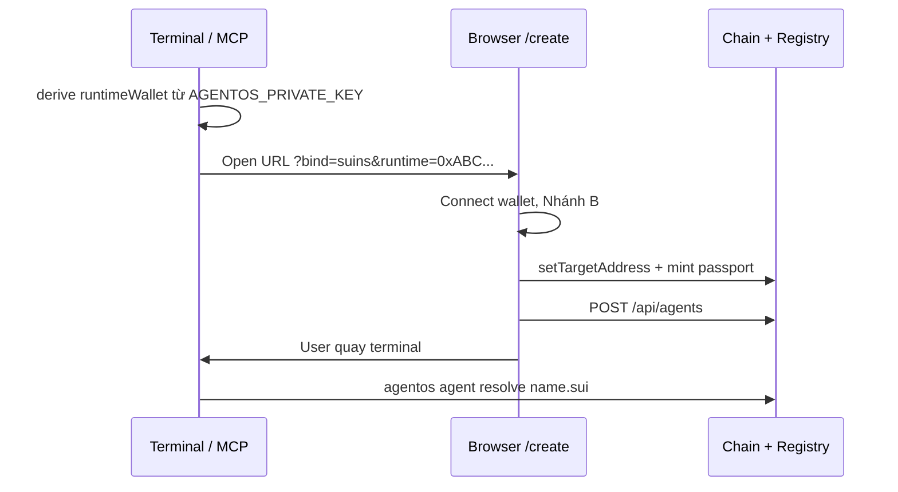

# UX: Tạo agent & gắn SuiNS

Spec UX đã chốt — dashboard `/create`, handoff từ terminal (Claude Code / MCP).

Liên quan: [post-suiperpower-flow.md](./post-suiperpower-flow.md) (pipeline kỹ thuật), [setup-env-auth-deploy.md](./setup-env-auth-deploy.md) (Enoki login).

**Trạng thái implement (2026-06):** Nhánh A/B SuiNS ✅ · mint on-chain + success modal ✅ · delete agent ✅ · API validate trước POST ⏳.

---

## Nguyên tắc

1. **Build** (Move, skill) → Suiperpower + terminal.
2. **Identity** (SuiNS bind, passport, registry) → **web** `/create` — user ký tx bằng ví browser.
3. **Chưa có SuiNS** → hướng dẫn + redirect [testnet.suins.io](https://testnet.suins.io) / [suins.io](https://suins.io) (không build check giá in-app v1).
4. **Đã có SuiNS** → import/bind trên web (không upload file — chọn name + gắn địa chỉ).
5. **Hai ví** — owner (browser) và runtime (agent local) **không auto-sync**; chỉ link qua địa chỉ + registry.

---

## Hai nhánh trên `/create`

```
┌─────────────────────────────────────────┐
│  ○ Get a new .sui name                  │  → Nhánh A
│  ○ Use a name I already own             │  → Nhánh B
└─────────────────────────────────────────┘
```

### Nhánh A — Chưa có SuiNS

User chưa sở hữu name. **Không** embed mua name trong AgentOS v1.

```text
Connect wallet (Enoki / Sui Wallet)
  → chọn "Get a new .sui name"
  → copy runtime address (xem mục Hai ví)
  → mở testnet.suins.io (tab mới) — hướng dẫn inline:
       "Register your name and set target address to: 0xRUNTIME..."
  → quay lại AgentOS → chọn Nhánh B để bind + mint
```

| Bước | Ở đâu | Ghi chú |
|------|--------|---------|
| Mua / đăng ký name | testnet.suins.io (dev) / suins.io (mainnet) | User trả phí / testnet SUI; AgentOS chỉ link |
| Set target address | suins.io hoặc Nhánh B | Trỏ `runtimeWallet` |
| Mint passport + registry | AgentOS web | Sau khi name đã owned + bind |

*(Tùy chọn sau v1: subname dưới domain team — gas only, preset trong Nhánh A.)*

### Nhánh B — Đã có SuiNS (import / bind)

Toàn bộ verify + on-chain bind + mint **trên web**.

```text
Connect wallet
  → "Use a name I already own"
  → chọn từ danh sách name trong ví HOẶC nhập research-bot.sui
  → verify: name tồn tại + NFT owner = signer (hoặc subname hợp lệ)
  → nếu targetAddress ≠ runtimeWallet → tx setTargetAddress (một bước bind)
  → mint AgentPassport + POST /api/agents (registry)
  → Step 2 success modal (Suiscan links) → **Manage skills** → `/agent/{slug}`
```

| Kiểm tra | Hành vi |
|----------|---------|
| Name không tồn tại / hết hạn | Lỗi + gợi ý Nhánh A (suins.io) |
| NFT owner ≠ ví đang connect | Lỗi — phải connect ví sở hữu name |
| `targetAddress` = `runtimeWallet` | Bỏ qua bind, mint passport |
| `targetAddress` ≠ `runtimeWallet` | `setTargetAddress(runtime)` rồi mint |
| Name đã gắn agent khác trong registry | Chặn |

**Danh sách name trong ví:** chỉ query NFT của **ví browser đang connect** — không đọc được key `AGENTOS_PRIVATE_KEY` trên máy local.

---

## Terminal → Web (Claude Code / MCP)

User build trong terminal; bước SuiNS **không** làm trong CLI — agent mở / in link dashboard.



### Terminal làm gì

```bash
# 1. Runtime address từ key local (agent headless)
#    derive 0xABC... từ AGENTOS_PRIVATE_KEY

# 2. Mở link (MCP in URL hoặc `open` / xdg-open)
#    {dashboardUrl}/create?bind=suins&runtime=0xABC...
#    Tuỳ chọn: &name=research-bot.sui

# 3. Sau khi user xong trên web
agentos agent resolve research-bot.sui
```

### Terminal **không** làm

- Ký `setTargetAddress` / mint passport (cần browser wallet).
- List SuiNS NFT (cần dapp-kit connect).
- `agentos_register_agent` cho bước bind thật (trừ dry-run / dev không SuiNS).

### Deep links

| Query | Mở |
|-------|-----|
| `?bind=suins` | Wizard Nhánh B ✅ |
| `?bind=suins&runtime=0x…` | Pre-fill runtime wallet ✅ |
| `?bind=suins&name=research-bot.sui` | Pre-fill tên (optional) ✅ |
| `?import=skill&agent=slug` | Import skill modal ✅ |

`dashboardUrl` trong `.agentos/config.json` (mặc định `http://localhost:3000`).

### MCP

Sau bind, agent gọi `agentos_resolve` / `agentos_dashboard_url` → `/agent/{slug}`.

---

## Hai ví: owner vs runtime

Contract `AgentPassport` tách sẵn:

| Field | Ý nghĩa | Thường là |
|-------|---------|-----------|
| `owner` | `tx.sender()` khi mint | Ví browser (Enoki zkLogin, extension) |
| `runtime_wallet` | Agent ký tx khi chạy | `AGENTOS_PRIVATE_KEY` trên máy user |
| SuiNS `targetAddress` | Resolve name → địa chỉ | **`runtime_wallet`** |

**Không có sync private key** giữa local ↔ browser. Chỉ đồng bộ **địa chỉ** qua registry + SuiNS target.

### Persona A — Một ví (MVP đơn giản)

- Browser connect = runtime = owner.
- Mua trên suins.io trỏ đúng ví Enoki.
- Phù hợp demo, agent không headless.

### Persona B — Agent headless (production)

```text
Browser (0xDEF...)  → sở hữu SuiNS NFT, ký bind + mint passport (owner)
Local key (0xABC...) → runtime_wallet; agent/MCP ký khi chạy skill
SuiNS target         → 0xABC... (pre-fill từ ?runtime= query)
```

Wizard hiển thị rõ:

> **SuiNS target must point to:** `0xABC…` (runtime)  
> **Name NFT owned by:** `0xDEF…` (connected wallet)

User **không** import agent private key vào browser.

### Bước runtime wallet trên wizard ✅

```
○ Same as connected wallet        ← Persona A (mặc định)
○ Dedicated agent address         ← Persona B — paste 0x... từ terminal
```

---

## Registry sync terminal ↔ web

| Môi trường | Registry |
|------------|----------|
| Local dev | `.agentos/registry.json` repo root — CLI, MCP, Next API **cùng file** |
| Production (Cloudflare) | Server-side path — terminal local cần chiến lược sync riêng (TBD) |

Sau Nhánh B trên web, terminal `agentos agent resolve` đọc được ngay (local monorepo).

---

## On submit (web) — thứ tự tx

1. (Nếu cần) `setTargetAddress(runtimeWallet)` — ký ví sở hữu SuiNS NFT.
2. `agent_passport::create(suins_name, runtime_wallet)` — khi có `packageId`.
3. `POST /api/agents` — sau verify UI (server-side validate ⏳):
   - name resolve được;
   - owner/bind khớp `runtimeWallet`;
   - không trùng agent trong registry.
4. **Success modal** — tx digest + Suiscan; CTA **Manage skills**.

Enoki sponsor: có thể sponsor **gas** mint passport; **không** trả phí mua SuiNS trên suins.io.

---

## Ma trận implement

| UX | Trạng thái |
|----|------------|
| Hai tab A / B | ✅ |
| Redirect SuiNS + copy runtime | ✅ |
| List owned names (browser) | ✅ |
| Verify owner + target | ✅ |
| `setTargetAddress` + mint PTB | ✅ |
| Deep link `?bind=suins&runtime=` | ✅ |
| Success modal + Suiscan | ✅ |
| Runtime wallet (Persona B) | ✅ |
| Delete agent | ✅ danger zone + `DELETE /api/agents/[slug]` + CLI |
| API validate trước POST | ⏳ |
| On-chain revoke passport | ⏳ |

---

## Copy UI (gợi ý)

**Nhánh A**

> Get a `.sui` name on [testnet.suins.io](https://testnet.suins.io) (or [suins.io](https://suins.io) on mainnet). Set the target address to your agent runtime address below, then return here to bind.

**Nhánh B**

> Select a name you own in the connected wallet, or enter it manually. We'll point it at your agent runtime address and mint your passport.

**Sau terminal handoff**

> Open this link in your browser to bind SuiNS and register your agent. Keep this terminal session — you'll continue here after.
