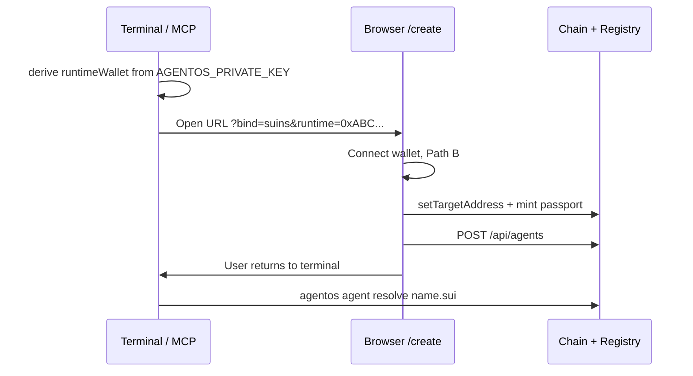

# UX: Create agent & bind SuiNS

Approved UX spec — dashboard `/create`, handoff from terminal (Claude Code / MCP).

Related: [post-suiperpower-flow.md](./post-suiperpower-flow.md) (pipeline + publish), [setup-env-auth-deploy.md](./setup-env-auth-deploy.md) (Enoki login).

**Implementation status (2026-06):** SuiNS paths A/B ✅ · on-chain mint + success modal ✅ · delete agent ✅ · API validate before POST ⏳.

---

## Principles

1. **Build** (Move, skill) → Suiperpower + terminal.
2. **Identity** (SuiNS bind, passport, registry) → **web** `/create` — user signs txs with browser wallet.
3. **No SuiNS yet** → guide + redirect to [testnet.suins.io](https://testnet.suins.io) / [suins.io](https://suins.io) (no in-app pricing in v1).
4. **Already own SuiNS** → import/bind on web (no file upload — pick name + set address).
5. **Two wallets** — owner (browser) and runtime (local agent) **do not auto-sync**; linked only via address + registry.

---

## Two paths on `/create`

```
┌─────────────────────────────────────────┐
│  ○ Get a new .sui name                  │  → Path A
│  ○ Use a name I already own             │  → Path B
└─────────────────────────────────────────┘
```

### Path A — No SuiNS yet

User does not own a name. **Do not** embed name purchase in AgentOS v1.

```text
Connect wallet (Enoki / Sui Wallet)
  → select "Get a new .sui name"
  → copy runtime address (see Two wallets)
  → open testnet.suins.io (new tab) — inline guide:
       "Register your name and set target address to: 0xRUNTIME..."
  → return to AgentOS → use Path B to bind + mint
```

| Step | Where | Notes |
|------|--------|-------|
| Buy / register name | testnet.suins.io (dev) / suins.io (mainnet) | User pays; AgentOS only links out |
| Set target address | suins.io or Path B | Point to `runtimeWallet` |
| Mint passport + registry | AgentOS web | After name is owned + bound |

*(Post-v1 option: subname under team domain — gas only, preset in Path A.)*

### Path B — Already own SuiNS (import / bind)

All verify + on-chain bind + mint happens **on web**.

```text
Connect wallet
  → "Use a name I already own"
  → pick from wallet name list OR enter research-bot.sui
  → verify: name exists + NFT owner = signer (or valid subname)
  → if targetAddress ≠ runtimeWallet → setTargetAddress tx (single bind step)
  → mint AgentPassport + POST /api/agents (registry)
  → Step 2 success modal (Suiscan links) → **Manage skills** → `/agent/{slug}`
```

| Check | Behavior |
|-------|----------|
| Name missing / expired | Error + suggest Path A (suins.io) |
| NFT owner ≠ connected wallet | Error — connect wallet that owns the name |
| `targetAddress` = `runtimeWallet` | Skip bind, mint passport |
| `targetAddress` ≠ `runtimeWallet` | `setTargetAddress(runtime)` then mint |
| Name already tied to another agent in registry | Block |

**Wallet name list:** only queries NFTs for the **connected browser wallet** — cannot read `AGENTOS_PRIVATE_KEY` on the local machine.

---

## Terminal → Web (Claude Code / MCP)

User builds in the terminal; SuiNS steps are **not** done in CLI — agent opens / prints a dashboard link.



### What the terminal does

```bash
# 1. Runtime address from local key (headless agent)
#    derive 0xABC... from AGENTOS_PRIVATE_KEY

# 2. Open link (MCP prints URL or use `open` / xdg-open)
#    {dashboardUrl}/create?bind=suins&runtime=0xABC...
#    Optional: &name=research-bot.sui

# 3. After user finishes on web
agentos agent resolve research-bot.sui
```

### What the terminal does **not** do

- Sign `setTargetAddress` / mint passport (needs browser wallet).
- List SuiNS NFTs (needs dapp-kit connect).
- Use `agentos_register_agent` for real bind (except dry-run / dev without SuiNS).

### Deep links

| Query | Opens |
|-------|-------|
| `?bind=suins` | Path B wizard ✅ |
| `?bind=suins&runtime=0x…` | Pre-fill runtime wallet ✅ |
| `?bind=suins&name=research-bot.sui` | Pre-fill name (optional) ✅ |
| `?import=skill&agent=slug` | Import skill modal ✅ |

`dashboardUrl` in `.agentos/config.json` (default `http://localhost:3000`).

### MCP

After bind, agent calls `agentos_resolve` / `agentos_dashboard_url` → `/agent/{slug}`.

---

## Two wallets: owner vs runtime

`AgentPassport` contract separates:

| Field | Meaning | Usually |
|-------|---------|---------|
| `owner` | `tx.sender()` at mint | Browser wallet (Enoki zkLogin, extension) |
| `runtime_wallet` | Agent signs txs at runtime | `AGENTOS_PRIVATE_KEY` on user's machine |
| SuiNS `targetAddress` | Name resolves to address | **`runtime_wallet`** |

**No private key sync** between local ↔ browser. Only **addresses** sync via registry + SuiNS target.

### Persona A — Single wallet (simple MVP)

- Browser connect = runtime = owner.
- Buy on suins.io pointing to the Enoki wallet.
- Good for demos, non-headless agents.

### Persona B — Headless agent (production)

```text
Browser (0xDEF...)  → owns SuiNS NFT, signs bind + mint passport (owner)
Local key (0xABC...) → runtime_wallet; agent/MCP signs when running skills
SuiNS target         → 0xABC... (pre-filled from ?runtime= query)
```

Wizard shows clearly:

> **SuiNS target must point to:** `0xABC…` (runtime)  
> **Name NFT owned by:** `0xDEF…` (connected wallet)

User **does not** import agent private key into the browser.

### Runtime wallet step on wizard ✅

```
○ Same as connected wallet        ← Persona A (default)
○ Dedicated agent address         ← Persona B — paste 0x... from terminal
```

---

## Registry sync terminal ↔ web

| Environment | Registry |
|-------------|----------|
| Local dev | `.agentos/registry.json` at repo root — CLI, MCP, Next API **same file** |
| Production (Cloudflare) | Server-side path — local terminal needs separate sync strategy (TBD) |

After Path B on web, terminal `agentos agent resolve` works immediately (local monorepo).

---

## On submit (web) — tx order

1. (If needed) `setTargetAddress(runtimeWallet)` — signed by SuiNS NFT owner wallet.
2. `agent_passport::create(suins_name, runtime_wallet)` — when `packageId` is set.
3. `POST /api/agents` — after UI verify (server-side validate ⏳):
   - name resolves;
   - owner/bind matches `runtimeWallet`;
   - no duplicate agent in registry.
4. **Success modal** — tx digest + Suiscan; CTA **Manage skills**.

Enoki sponsor: can sponsor **gas** for passport mint; **cannot** pay SuiNS name purchase on suins.io.

---

## Implementation matrix

| UX | Status |
|----|--------|
| Two tabs A / B | ✅ |
| SuiNS redirect + copy runtime | ✅ |
| List owned names (browser) | ✅ |
| Verify owner + target | ✅ |
| `setTargetAddress` + mint PTB | ✅ |
| Deep link `?bind=suins&runtime=` | ✅ |
| Success modal + Suiscan | ✅ |
| Runtime wallet (Persona B) | ✅ |
| Delete agent | ✅ danger zone + `DELETE /api/agents/[slug]` + CLI |
| API validate before POST | ⏳ |
| On-chain revoke passport | ⏳ |

---

## Suggested UI copy

**Path A**

> Get a `.sui` name on [testnet.suins.io](https://testnet.suins.io) (or [suins.io](https://suins.io) on mainnet). Set the target address to your agent runtime address below, then return here to bind.

**Path B**

> Select a name you own in the connected wallet, or enter it manually. We'll point it at your agent runtime address and mint your passport.

**After terminal handoff**

> Open this link in your browser to bind SuiNS and register your agent. Keep this terminal session — you'll continue here after.
